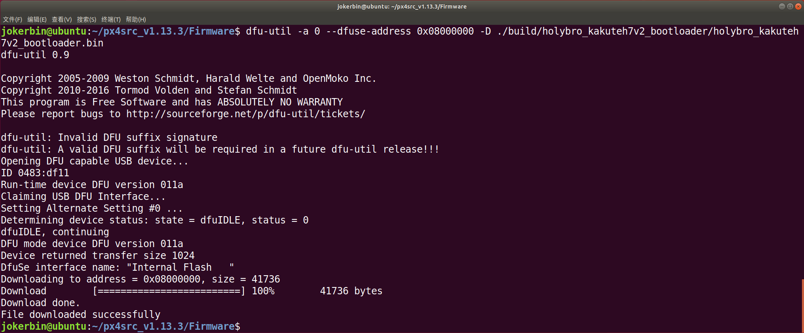
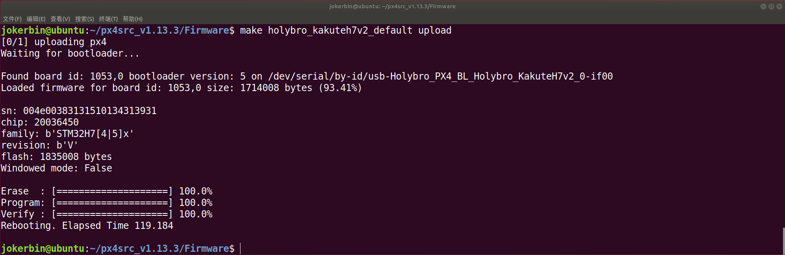

# KakuteH7V2或KakuteH7MiniV2烧录PX4固件

第一次在Ubuntu中使用命令`make holybro_kakuteh7v2 upload`命令给Holybro Kakute H7 V2和Kakute H7 Mini V2烧录PX4固件后，发现使用地面站调参后，掉电后调的参数会恢复默认值。

在Github上PX4项目问题栏搜索相关问题，发现有人发现了这个问题并解决了该问题，已经合并进了主分支并且在用户手册中补充了注意事项。

[Add BMI270 driver, and support for KakuteH7v2 and KakuteH7mini by j-chen-opteran · Pull Request #20545 · PX4/PX4-Autopilot · GitHub](https://github.com/PX4/PX4-Autopilot/pull/20545)

[Bootloader Flashing for Kakute H7 v2 and mini by arguelle · Pull Request #2353 · PX4/PX4-user_guide · GitHub](https://github.com/PX4/PX4-user_guide/pull/2353)

Holybro Kakute H7 V2和Kakute H7 Mini V2在出厂时自带Betaflight固件，如果直接先烧录PX4固件的bootloader再烧录PX4固件的话，会导致闪存中的数据没有被完全擦写造成故障。

## 解决方法

这是官方手册中写的解决办法。

[PX4 Bootloader Flashing onto Betaflight Systems | PX4 User Guide](https://docs.px4.io/main/en/advanced_config/bootloader_update_from_betaflight.html)

先使用以下命令将固件和bootloader编译好备用。

```
make holybro_kakuteh7v2_bootloader
make holybro_kakuteh7v2
```

没有安装烧录工具的先安装dfu-util烧录工具包。

```
sudo apt install dfu-util
```

**按住飞控板上的BOOT键同时将USB线插入飞控板**，进入DFU模式。

Holybro Kakute H7 V2和Kakute H7 Mini V2在烧录固件时需要运行一个额外的命令来擦除闪存参数，不然会出现地面站设置参数掉电后重置无法保存的问题。

该命令需要在Firmware文件夹下运行，该命令在执行中可能会报错，如果在执行中有擦写的进度条，那么这个报错可以忽略：如果执行中没有擦写的进度条，说明没有执行擦写动作，则需重新进入DFU模式进行擦写。

```
dfu-util -a 0 --dfuse-address 0x08000000:force:mass-erase:leave -D build/holybro_kakuteh7v2_bootloader/holybro_kakuteh7v2_bootloader.bin
```


拔出USB线之后再次按住飞控板上的BOOT键同时将USB线插入飞控板，进入DFU模式。

运行命令烧录bootloader。

```
dfu-util -a 0 --dfuse-address 0x08000000 -D ./build/holybro_kakuteh7v2_bootloader/holybro_kakuteh7v2_bootloader.bin
```



之后使用以下命令烧录PX4固件即可。

```
make holybro_kakuteh7v2 upload
```




****

参考资料：

[PX4 Bootloader Flashing onto Betaflight Systems | PX4 User Guide](https://docs.px4.io/main/en/advanced_config/bootloader_update_from_betaflight.html)

[Add BMI270 driver, and support for KakuteH7v2 and KakuteH7mini by j-chen-opteran · Pull Request #20545 · PX4/PX4-Autopilot · GitHub](https://github.com/PX4/PX4-Autopilot/pull/20545)

[Bootloader Flashing for Kakute H7 v2 and mini by arguelle · Pull Request #2353 · PX4/PX4-user_guide · GitHub](https://github.com/PX4/PX4-user_guide/pull/2353)

[Supported Firmware - Holybro Docs](https://docs.holybro.com/fpv-flight-controller/kakute-h7-v2/supported-firmware)
