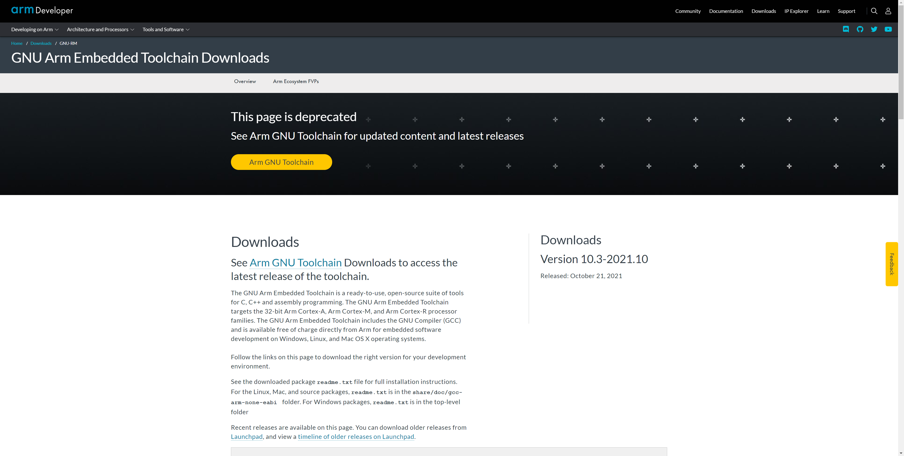
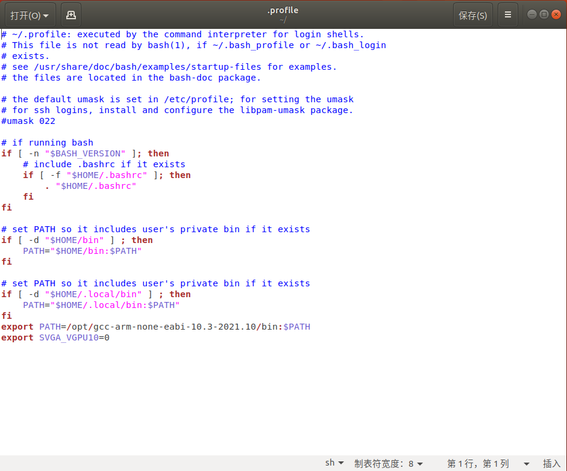
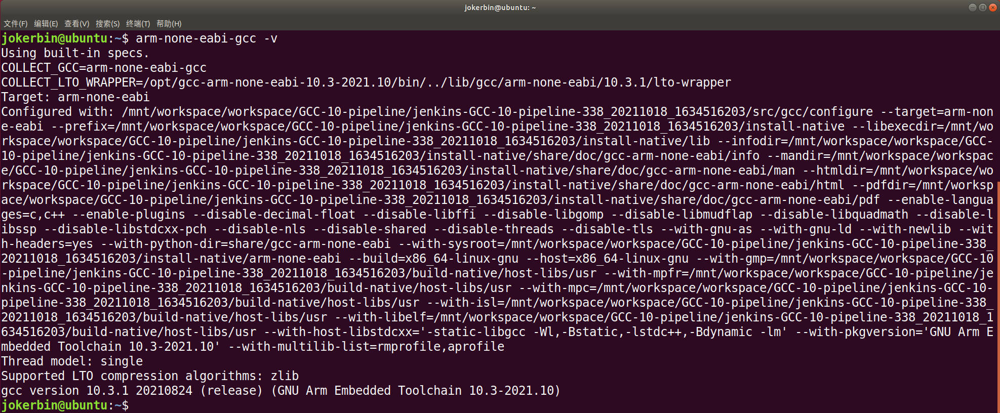

# Ubuntu中安装指定版本的gcc-arm-none-eabi

在 Ubuntu 中开发基于 ARM 架构的 STM32 芯片，需要安装交叉编译器 gcc-arm-none-eabi编译代码，那么什么是交叉编译器呢？

Ubuntu 自带的 gcc 编译器是针对 X86 架构的！而我们现在要编译的是 ARM 架构的代码，所以我们需要一个在 X86 架构的 PC 上运行，可以编译 ARM 架构代码的 GCC 编译器，这个编译器就叫做交叉编译器，总结一下交叉编译器就是：

（1）它是一个 GCC 编译器；

（2）这个 GCC 编译器是运行在 X86 架构 PC 上的；

（3）这个 GCC 编译器是编译 ARM 架构代码的，也就是编译出来的可执行文件是在 ARM 芯片上运行的。

交叉编译器中“交叉”的意思就是在一个架构上编译另外一个架构的代码，相当于两种架构“交叉”起来了。

## GNU Arm Embedded Toolchain简介

GNU Arm Embedded Toolchain 是用于 C、C++ 和汇编编程的即用型开源工具套件。GNU Arm 嵌入式工具链适用于 32 位 Arm Cortex-A、Arm Cortex-M 和 Arm Cortex-R 处理器系列。GNU Arm 嵌入式工具链包括 GNU 编译器 (GCC)，可直接从 Arm 免费获得，用于在 Windows、Linux 和 Mac OS X 操作系统上进行嵌入式软件开发。

## gcc-arm-none-eabi安装

Ubuntu 16.04 之后的软件源是自带 gcc-arm-none-eabi 的，只是自动安装后的版本不一定符合要求，造成编译时报错。

### 自动安装

打开终端，输入命令，使用 Ubuntu 自带的 APT 下载工具安装 gcc-arm-none-eabi。

```
sudo apt-get install gcc-arm-none-eabi
```

安装完成后，再输入命令获取版本号，可以在最后一行看到版本号。

```
arm-none-eabi-gcc -v
```

Ubuntu16.04 和 Ubuntu18.04 都可以自动安装，只是默认版本号高低不同。

Ubuntu16.04下 gcc 版本号：gcc version 4.9.3 20150529；Ubuntu18.04下 gcc 版本号：gcc version 6.3.1 20170620。

### 手动安装（推荐）

官网下载：https://developer.arm.com/downloads/-/gnu-rm



这里选择了10.3-2021.10版本，可以根据自己的需要下载其它版本。 

将下载好的软件包放在Desktop桌面，使用命令将其移动到opt文件夹。

```
sudo mv ~/Desktop gcc-arm-none-eabi-10.3-2021.10-x86_64-linux.tar.bz2 /opt
```

进入opt文件夹。

```
cd /opt
```

解压下载的软件包。

```
sudo tar -vxf gcc-arm-none-eabi-10.3-2021.10-x86_64-linux.tar.bz2
```

解压后删除压缩包，留下解压后的文件夹。

```
sudo rm gcc-arm-none-eabi-10.3-2021.10-x86_64-linux.tar.bz2
```

安装环境依赖包，如果不安装所有依赖包的话执行arm-none-eabi-gcc时会显示找不到文件或文件夹。

```
$ sudo apt-get install lsb-core
$ sudo apt-get install lib32ncurses5 lib32tinfo5 libc6-i386
```

添加环境变量到用户目录下的 .profile 文件，这里可以使用gedit命令也可以使用vim命令进行编辑。

```
sudo gedit ~/.profile
sudo vim ~/.profile
```



在文件的最后一行空白处添加一行代码，保存后关闭。

```
export PATH=/opt/gcc-arm-none-eabi-10.3-2021.10/bin:$PATH
```

如果已经安装了gcc-arm-none-eabi想进行版本修改的话，可将`export PATH=/opt/gcc-arm-none-eabi-9-2019-q4-major/bin:$PATH`改成`export PATH=/opt/gcc-arm-none-eabi-10.3-2021.10/bin:$PATH`即可（更改路径中的版本名称）。

使能环境变量，有时需要重启系统才能永久生效。

```
source ~/.profile
```

检查交叉编译器是否安装成功，输入以下命令。

```
arm-none-eabi-gcc -v
```



如果安装成功后编译还出现报错可以使用`make clean`命令清除上次的make命令所产生的object文件及可执行文件，重新编译。


****

参考资料：

[Ubuntu中gcc-arm-none-eabi的安装、移除和版本切换_arm-none-eabi-gcc_EmotionFlying的博客-CSDN博客](https://blog.csdn.net/qq_20016593/article/details/125343260)

[在Linux Ubnutu下安装arm-none-eabi-gcc及所必须的各种依赖包_gcc-arm-none-eabi下载_风吹花中花吹风的博客-CSDN博客](https://blog.csdn.net/qq_35333978/article/details/109738462)
