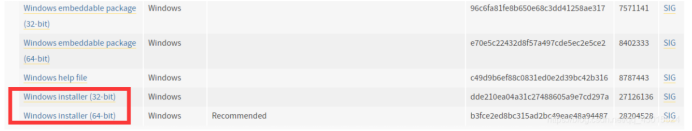
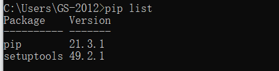
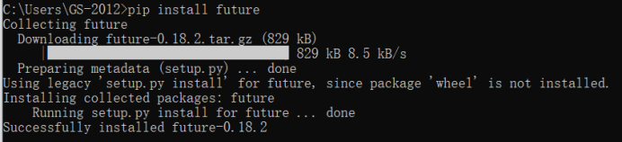
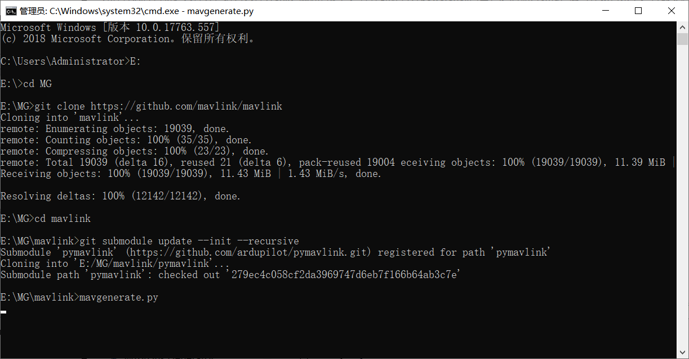

# Windows系统下Mavlink generate的安装及使用   

(k.10.21)  

## 1.Mavlink Generator介绍  

Mavlink Generator可以根据xml格式的消息生成可供调用的库。其中xml文件中定义的为枚举类型和消息负载（Mavlink Frame中payload），Mavlink Generator会自动生成各种语言的解析和封包函数库，用户只需关注并设计消息负载即可。  
Mavlink Generator为一个python脚本，其运行需要python环境，并且，需要python中的future包。Python2和python3都行。    

***

## 2.Windows系统安装python  

直接去python官网下载对应的安装包，双击运行安装包，一定要勾选“Add python to PATH”加入到环境变量中，其他默认下一步。   

<center>
</img>
</center>

安装完成后，Win+R进入cmd中，运行python -V或python3 -V出现版本号，即安装成功。  
运行pip -V查看pip的版本。    

运行pip list出现已安装的包列表。   

<center>
</img>
</center>


没有futrue包，则通过pip install futrue安装。  

若出现报错，先把pip按照提示更新到最新版本：输入"python -m pip install --upgrade pip"命令让它升级到最新版本；  

***

## 3.使用pip安装一些库时出现ERROR: Could not find a version that satisfies the requirement [tensorflow](https://so.csdn.net/so/search?q=tensorflow&spm=1001.2101.3001.7020) (from versions: none)  解决办法  

有时我们使用pip安装需要使用的某些包时会报如下错误：  

<center>
</img>
</center>

ERROR: No matching distribution found for tensorflow的情况。  
这可能是因为网络的问题，这时我们使用国内的镜像源来加速。  
输入命令：python -m pip install tensorflow(此处我们要安装的是future库，请输入库名future） -i http://pypi.douban.com/simple/ --trusted-host pypi.douban.com  

```
python -m pip install future -i http://pypi.douban.com/simple/ --trusted-host pypi.douban.com  
```

这时就安装成功了。  

<center>
</img>
</center>


***

## 4.下载Mavlink Generator  

通过git方式下载：git clone https://github.com/mavlink/mavlink    

```
C:\Users\Administrator>E:
//跳转至E盘
```

```
E:\>cd MG
//cd命令跳转至创建好的文件夹MG
```

```
E:\MG>git clone https://github.com/mavlink/mavlink
//执行下载命令
```

<center>
</img>
</center>


****

## 5.运行Mavlink Generator  

a、进入mavlink文件夹：

```
cd mavlink
```

***

b、更新子模块：

```
git submodule update --init --recursive    
```

***

c、运行Mavlink Generator     

```
E:\MG\mavlink>mavgenerate.py
```

***

打开成功之后如下图所示：  

<center>
</img>
</center>


## 参考资料：  

————————————————
版权声明：本文为CSDN博主「咆哮的蘑菇」的原创文章，遵循CC 4.0 BY-SA版权协议，转载请附上原文出处链接及本声明。
原文链接：https://blog.csdn.net/weixin_43847923/article/details/121805346

————————————————
版权声明：本文为CSDN博主「Li-123456」的原创文章，遵循CC 4.0 BY-SA版权协议，转载请附上原文出处链接及本声明。
原文链接：https://blog.csdn.net/shaui541607120115/article/details/89640808

————————————————
版权声明：本文为CSDN博主「假的程序猿LC」的原创文章，遵循CC 4.0 BY-SA版权协议，转载请附上原文出处链接及本声明。
原文链接：https://blog.csdn.net/qq_43015524/article/details/113005636