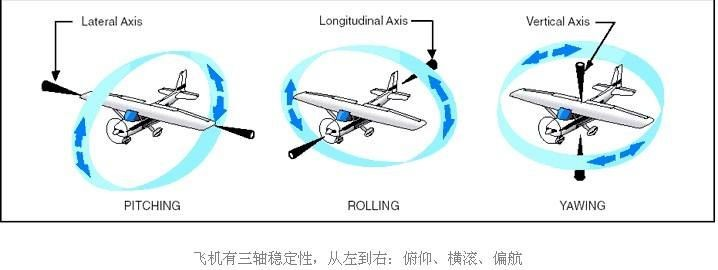

# 无人机飞控入门教程

## 无人机入门
### 1、无人机定义
无人驾驶飞行器（UAV=Unmanned Aerial Vehicle），是利用无线电遥控设备和自备的程序装置操纵的不载人飞行器。
从技术角度定义可以分为无人固定翼飞机、无人垂直起降飞机、无人飞艇、无人直升机、无人多旋翼飞行器、无人伞翼机等。
与载人机相比，它具有体积小、造价低、使用方便、对作战环境要求低、战场生存能力强等优点。
本文仅讨论多旋翼的飞行器。

### 2、飞控、机载计算机
飞控又称飞行控制器、自动驾驶仪，是用于在起飞、巡航、降落等阶段辅助或全自主对飞行器的其他系统及元器件起到协同控制的元件。简单来说，飞控就是实现无人机底层控制的东西，什么是底层控制？底层控制就是动力输出（怎么将动力分配到多个旋翼上），稳定飞行（受到干扰怎么维持稳定）这些，可以比作人的小脑。目前主流的飞控有国外的Pixhawk，国内的匿名科创，ACFly等等，其中Pixhawk历史最久且性能优秀，同时可以轻松与上位机通信，所以我们选择Pixhawk进行控制。Pixhawk我们选择最新的Pixhawk4型号，其主芯片为STM32F765，可以理解为一个微型电脑（只不过不能运行完整操作系统）或者专门设计的STM32单片机。
机载计算机，顾名思义就是安装在无人机上的计算机，有体积小，功耗低，性能强大等特点，可以实现无人机的智能控制与自主决策，弥补了飞控无法进行高级开发的缺点，机载计算机目前主流有树莓派，Jetson等，搭载Ubuntu系统，使用ROS等框架和库，连接飞控，进行无人机的智能控制与自主决策。

## 无人机硬件架构
### 1、机架
机架是无人机的骨架，承载无人机所有电子设备，大小以轴距进行区分，450型号指对角线上两个电机轴的距离为450mm，机架越大，需要的电机功率越大，桨叶也越大，否则无法起飞；机架目前主要是塑料、碳纤维两种，碳纤维机械性能好，但是价格 更贵。
### 2、桨叶
桨叶是专门型号的，根据物理原理，桨叶的转动惯量（相对转轴）与半径的五次方成正比（近似），所有大桨叶响应慢，不容易改变运动状态（即转速），同时桨叶分正反转向，因为单个螺旋桨由电机带动旋转时会产生一个力使得无人机沿中轴线水平旋转，所以需要设置不同转向来抵消，否则多旋翼无人机会在起飞之后持续旋转，不过基于这个原理，可以用转速控制无人机的偏航运动。
### 3、电机
电机为专用三相无刷电机，三个接线端子（没有正负极之分，只需将任意两个端子反接即可实现反向转动），单向转动，功率大，摩擦小，可以提供非常大的升力。电机的kv值指的是在1v电压下，空载电机每分钟的转速，380kv的电机指的是1v电压下， 电机空载每分钟转380圈，但是电机不是kv值越大越好，在功率相同情况下，kv值越大，电机提供的力矩越小，所以高kv值的电机配小桨叶，低kv值的电机配大桨叶，比如380kv的电机一般装载16寸直径桨叶，980kv的电机装载10寸直径桨叶，更高kv的电机会装备6寸、4寸桨叶甚至作为涵道电机（涵道是固定翼飞行器也就是战斗机外形的飞行器所有的，向后推进）。
### 4、电调
电子调速器（简称ESC）是接受PWM控制信号并且控制电机转速的电子设备，可以接受来自于Pixhawk或者信号接收器的PWM信号，然后控制电机旋转，电调有三种线，三个黑色的圆形头（称为香蕉头）接无刷电机，不分正反，任意反接两个接口即可让电机 反向转动；然后是长的粗黑线红线，接的是供电电源，黑色接GND（负极），红色接VCC（正极），千万不能接反，否则会在接通电源的时候会冒一大股烟然后烧坏电调；最后是缠绕在一起的黑白线，这是信号线，接受控制信号并且控制电流，其中黑色为地线，白色为信号线，接飞控输出端。
### 5、电流计
电流计并不是显示电流大小的传感器，是给飞控供电的模块，接入高压的锂电池，然后输出稳定的电压驱动飞控，Pixhawk4的电流计更是集成的更多功能，可以成为给电调供电的枢纽（相当于分线板），飞控的转接板（把飞控多个引脚引出，有助于飞控减小体积）。
### 6、电池
无人机动力来源，无人机专用的电池，放电功率大，放电效率高，1S相当于一节锂电池串联（无人机用的都是串联起来的锂电池），无人机越大，一般需要的电压越高，如450的无人机一般用3S或者4S锂电池，680的会使用6S锂电池，每一节锂电池的满电电压为4.2V，空电电压为3.7V，所以电池到达最大电压（节数乘4.2V）时即为充电完成，到达最低电压时（节数乘3.7V）就不应该再使用。
## Z410无人机介绍
Z410机型是一款二次开发入门机型。基础版采用Pixhawk2.4.8飞控和M8N GPS模块；进阶版在基础板机型上安装了树莓派3b+机载电脑，可通过dronekit-python编程实现对无人机的外部控制。树莓派已经安装ubuntu mate 系统，并且已经安装好Dronkit、ROS、mavros、思岚 A1 驱动、Google Cartographer等，可直接上手学习。
### 能学到什么？
- 无人机的基本结构以及组装一台无人机的入门知识
- 无人机的基本操作
- 飞控与机载电脑的通讯
- Ubuntu 系统的基本操作
- ROS 机器人系统入门
- 室内无 GPS 环境下的定位悬停(搭配 T265 的升级版)
### 以后扩展开发方向
- 室内无 GPS 环境下的避障导航
- 整套系统可移植到无人车或则无人船，加思岚 A1 激光雷达实现 slam 建图
- 利用 dronekit-python 编程实现更复杂的控制
## Z410无人机基础遥控飞行教程
### Z410飞行前的准备：
准备好机架（GPS模块、遥控器接收机、Pixhawk2.4.8飞控、蜂鸣器、数传模块、BB响）、桨叶、数传接收机、5200mAh电池、遥控器，先装好无人机上图传天线、数传天线（**不装的话有可能因为功率大烧掉**），电池用扎带安装紧固防止脱落，**电池线接在BB响上（黑色线靠在最外侧）**，螺旋桨分正反浆，需要对应顺逆时针**拧紧**，GPS模块箭头方向需要与机头方向一致，遥控器开机时开关、摇杆需要在初始位置，先开遥控器再开无人机，等GPS信号连接，**GPS连接后飞控上的指示灯为绿色**，为蓝色表示未连接，长按安全开关解锁无人机，飞行结束后**先断开无人机电池再关遥控器**，记得拔出BB响上的电池线。
http://v.youku.com/v_show/id_XNDY3MjgxNDExNg==.html
### 遥控器介绍及自稳模式飞行：

遥控器右上角两个开关（左侧三档、右侧两档）对应6种飞行模式，**左上右上－定高，左中右上－悬停，左下右上－返航，左上右下－降落，左中右下－绕圈，左下右下－自稳**，手动操作时用自稳模式，自稳模式不需要气压计定高和GPS定位，**左边摇杆移右下角按住解锁，移左下角按住上锁**，解锁后不动油门会自动上锁。
http://v.youku.com/v_show/id_XNDY3MjgwMjk0NA==.html
定高，悬停，返航模式飞行：
定高模式用气压计定高，悬停模式加入GPS定位，当拨到返航模式后无人机会自动垂直升到15米然后回到起飞点降落并上锁。
http://v.youku.com/v_show/id_XNDY3Mjg1MDUwMA==.html
降落，绕圈，有头无头及结束飞行操作：
拨到降落模式后无人机会原地降落并上锁，拨到绕圈模式后无人机会以5米为半径机头朝向圆心绕圈，遥控器左上角两档开关控制有头无头模式，上－有头，下－无头。
http://v.youku.com/v_show/id_XNDY3Mjg2NjIwNA==.html
## Pixhawk调试教程
图文并茂详细教程之——用pixhawk飞控组装一台S500四轴无人机（上）
https://blog.csdn.net/sinat_16643223/article/details/107039360

图文并茂详细教程之——用pixhawk飞控组装一台S500四轴无人机（中）
https://blog.csdn.net/sinat_16643223/article/details/107039414

图文并茂详细教程之——用pixhawk飞控组装一台S500四轴无人机（下）
https://blog.csdn.net/sinat_16643223/article/details/107039442
## 几个重要的网址
Pixhawk是一套飞控硬件，它可以运行两套系统PX4或者AutoPolit
PX4原生固件及其地面站网址
https://github.com/PX4
http://px4.io/
https://github.com/mavlink/qgroundcontrol
原生固件代码：C++，构架清晰，容易维护修改，多进程，基于QT开发
目前来讲功能方面和细节上不如APM固件

AutoPoilt 固件及其地面站网址
http://ardupilot.org/
https://github.com/ArduPilot/ardupilot
https://github.com/ArduPilot/MissionPlanner
APM固件代码：C++，稳定成熟，功能丰富，发起时间比较早，基于C#开发
系统构架不如原生固件那么清晰，相对来讲不容易维护和修改

PIXHAWK控制器硬件 PCB工程原理图和电路板
https://github.com/PX4/Hardware
## 飞控调试注意事项
IMU（Inertial Measurement Unit）惯性测量单元，用来检测飞机的姿态，起飞前需要安装校准，一般包含陀螺仪、磁力计、加速度计三个部分。

</img>

- 陀螺仪：会有积分漂移，时间一长陀螺仪数据就不准了，其次IMU半导体器件对温度敏感，所以IMU都会受温度影响，一般的商业飞控会给陀螺仪和加速度计做恒温。存在积分漂移，引起较大偏差。需要加速度计和磁力计校准。
- 加速度计：对于震动敏感，所以飞控要有减震措施。
- 磁力计：磁力计是检测地球微弱磁场的，对于铁塔，有电磁干扰的地方敏感，大的铁块靠近磁力计，磁力计就会报错。所以飞机靠近铁塔，飞机有可能会失控。
- 陀螺仪，通过飞控多次采集陀螺仪数据，求均值，得到零点偏移。所以在校准陀螺仪的时候要静止一段时间。
- 加速度计，做六面校准，利用每个轴的重力加速度来参考定标。如果飞机会固定的角度，往某个方向飘，多半是因为加速度有安装误差，或者没有很好的校准。当然也有可能是因为遥控器没有校准，或者没有回到中位，遥控器跳舵。校准注意的是添加加速度计减震，减少安装角度误差，六面校准的时候尽量的横平竖直。
- 磁力计，磁力计在安装在飞机上的时候，可能会有硬磁干扰(电机上的磁铁，大功率恒定功率导线)，软磁干扰(随时间，地点变化的磁场，通电导线时变化的电流)。如果是小型四轴飞行器的校准，就是让四轴飞机保持通电状态，进行校准，并且在安装飞控的时候，让飞控尽可能的远离铁块，大电流。在测试飞行的时候，卸下桨让电机保持全速运行一段时间看磁罗盘有没有报错。