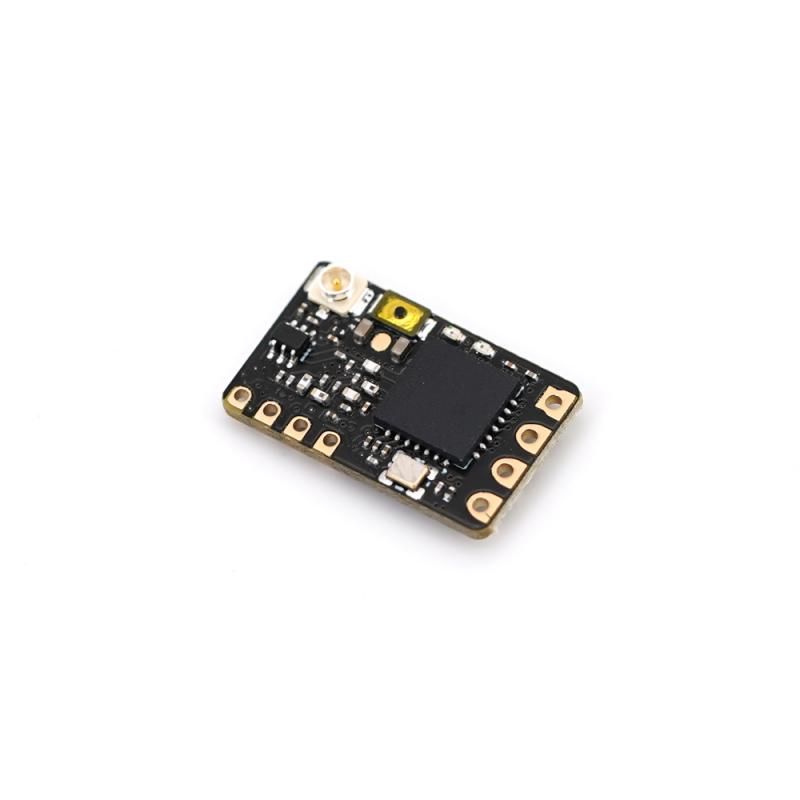
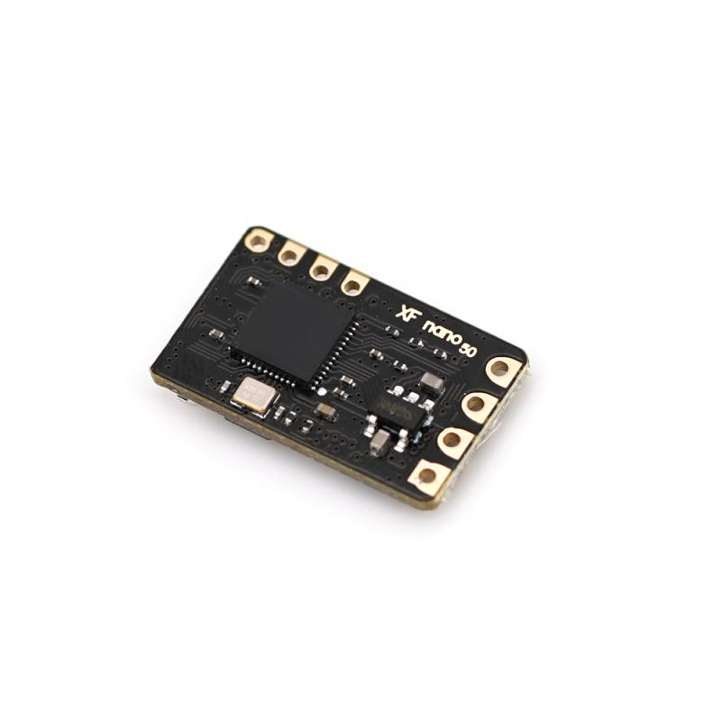
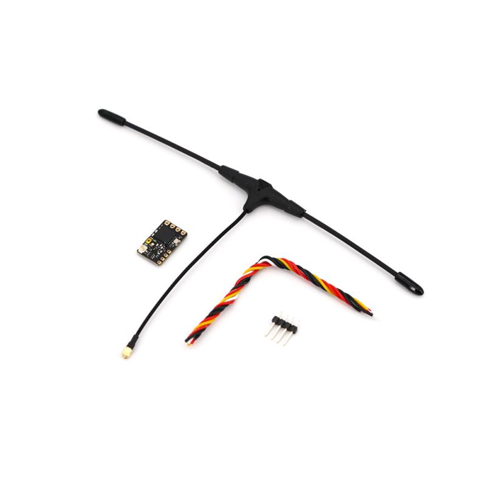
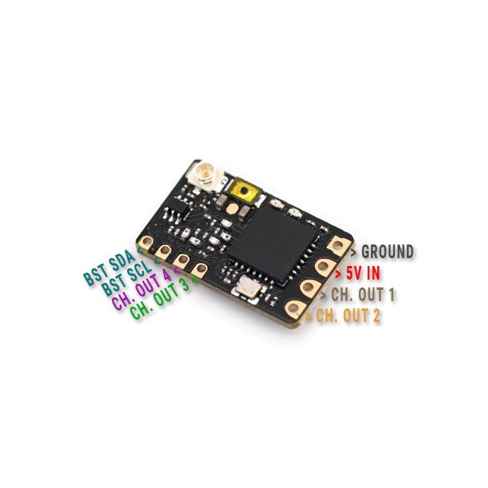

# 黑羊接收机使用方法

## 型号：TBS CROSSFIRE NANO RX (SE)

TBS Crossfire nano RX适用于那些想要节省空间和焊料的人。全系列专为迷你和微型四头肌设计！特别版（SE）包括TBS Immortal-T V2天线！

**请与Crossfire固件V6.10或更高版本一起使用。**

| **Weight**      | 0.5g (receiver only) |
| --------------- | :------------------: |
| **Size**        |     11mm x 18mm      |
| **Requires**    |    Firmware V2.25    |
| **Input Power** |    +3.3V to 8.4V     |

[官方使用手册](黑羊接收机使用方法/tbs-crossfire-nano-quickstart.pdf)